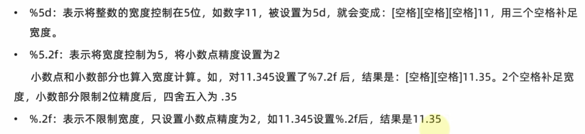

#### 数据类型

type()函数 => 查看数据类型

python中的变量没有类型区分，数据有

int(x) => 将x转换为整数类型，浮点数转整数会丢失精度

float(x) => 将x转换为浮点数类型

str(x) => 将x转换为字符串类型，所有数据类型皆可以转换为字符串类型，反之则否


#### 标识符（变量、类、方法  名称）

- 内容限定（英文、中文、数字、_）,不推荐中文，不能以数字开头
- 不可以使用关键字
- 大小写敏感


#### 运算符

```txt
+
- 
* 
/ 
//整除 
%模运算 
**幂运算
```


#### 字符串

##### 定义法

- 单引号定义
- 双引号定义（常用）
- 三引号定义（需要赋值给变量，否则是多行注释）

单引号内可以包含双引号而不需要转义字符`\`，调换同样成立


##### 字符串拼接

字符串类型字面量、变量都可以用`+`拼接

字符串不能与其他类型数据拼接


###### 字符串格式化

通过占位的形式完成拼接


常用占位符


格式：`print("%s, %d, %f" %(变量，表达式，....，))`


辅助符号 `m.n` 来控制数据的宽度和精度



.n 会对数据进行四舍五入

m小于数据宽度是，不生效


字符串格式化快速写法

`print(f"{变量}内容，{表达式}内容{变量}内容")`

这种写法不关心数据类型，不做精度控制


#### input语句

result = input("提示语句")  

默认接受数据为字符串类型，需要特定类型时需要进行类型转换

#### 布尔运算


布尔类型字面量`True ` 、`False`，注意开头大写


#### if elif else语句

```python
# 一个代码块四个空格进行缩进
if 条件1:
    满足条件1执行的表达式
elif 条件2:
    满足条件2执行的表达式
else:
    所有条件都不满足执行的表达式
	
```


#### 循坏语句

##### while循环

```python
# 九九乘法表打印
i = 1
while i <= 9:
    j = 1
    while j <=i:
        print(f"{i} * {j} = {i * j}\t", end="")
        j +=1
    print("")
    i += 1
    
```


num = random.randint(1,100) 一到一百的随机整数

 

##### for循环

```python
"""
for 临时变量 in 待处理数据集:
	执行代码
	
临时变量可以在循环外部访问到，但在外部访问时应预先定义好，这样符合代码规范，但不是强制要求

待处理数据集严格称为序列类型（其内容可以一个个依次取出的一种类型）字符串、列表、元组等
"""
 for i in range(1, 10):
 	for j in range(1, i + 1):
 		print(f"{i} * {j} = {i * j}\t", end="")
    print()
        
```


`range()`函数


`continue`关键字：中断本次循环，进行下一次循环


`break`关键字：结束所属代码块循环


#### 函数

 函数的定义

```python
def 函数名(x, y):
    """
    说明文档
    :param x: .....
    :param y: .....
    :return: .....
    """
    result = x + y
    print(result)
    
    return result

# 无返回值的函数，默认返回值为None <class 'NoneType'>,表示空
```


函数定义的变量为局部变量，只能在函数体内有效

`global`关键字，可以让在函数内声明的变量为全局变量


##### 进阶

```py
# 多返回值
def text():
    return 1, 2, 3
x, y, z = text

# 传参
def user_info1(name, age, gender='boy' ) # gender默认参数写法，需要放在参数列表最后
def user_info2(*args) # 位置不定长参数,args是元组类型
def user_info3(**kwargs) # 关键字不定长参数，参数需要以键值对形式传递，kwargs是字典类型
#函数也可以作为参数传递

user_info1('a', 20, 'boy') # 位置传参
user_info1(name = 'a', age = 20, gender = 'boy') # 关键字传参,不受位置限制

```


##### lambda匿名函数


```py
test_func(lambda x, y: x + y)
```


#### 数据容器

##### 列表

````python
my_list = [[1, 2, 3], "a", "b"]

# 索引
my_list[2] = my_list[-1]

# 重新赋值
my_list[0][1] = "d" 

# 查找元素在列表中的索引值
index = mylist.index("b") ==> 1

# 在列表指定位置插入元素
my_list.insert(1, "itheima") ==> [[1, 2, 3] "itheima", "a", "b"]

# 追加元素到列表尾部
my_lsit.append("hhh") ==> [[1, 2, 3], "a", "b", "hhh"] # 单元素追加

my_list2 = [5, 6, 7]
my_lsit.extend(my_list2)  # [[1, 2, 3], "a", "b", 5, 6, 7]  追加多元素

# 元素删除
del my_list[0] ==> ["a", "b"]

value = my_list.pop(2) ==> [[1, 2, 3], "a"] # 删除并取出

my_lsit.remove("a") # 指定元素删除， 将从左往右第一个符合的元素删除

# 清空列表
my_lsit.clear()

# 统计指定元素数量
my_lsit.count("a") == 1

# 统计列表元素数量
len(my_list) == 3

# 列表的遍历
index = 0
while index < len(my_list):
    data = my_list[index]
    print(data)
    index += 1
    
for element in my_list:
    print(element)


````

反向索引：从右向左，第一个是-1，第二个是-2，以此类推

特点：

- 可以容纳多个元素（2**63-1个）
- 可以容纳不同类型的元素
- 数据是有序存储的
- **允许重复数据存在**
- 可以修改


##### 元组

```python
t1 = (("a", "b", 0), 1, "hello", True)

# 空元组定义
t2 = ()
t3 = tuple()

#取元素
t1[0][1] # "b"

# 操作
index()
count()
len()

```


特点：

- **元素不可修改**
- **若内嵌列表，列表内元素可以修改**
- 允许重复数据存在
- 有序存储


##### 字符串

```python
my_str = "itheima and itcast"

value1 = my_str[2] # h
value2 = my_str[-1] # t

# 取元素索引
value3 = my_str.index("and") # 8

# replace方法
# 复制字符串后替换，不会改变原有字符串
my_str1 = my_str.replace("it", "程序")

# split方法
# 切割字符串，同样不会源字符串，而是得到一个新的列表
my_str2 = my_str.split(" ") # ["itheima", "and", "itcast"]

# 字符串的规整操作
my_str.strip() #去除前后空格以及换行符
my_str.strip(字符串) # 去除前后指定字符串

# 统计字符串指定字符出现的次数
my_str.count()

#统计字符串的字符个数
len(my_str)
```


特点：

- 只可以存储字符串

- 对字符串操作产生的是新的对象，不会改变原字符串
- 不支持修改


##### 序列的切片

内容连续、有序，支持下标索引的一类数据容器


```python
# 对list进行切片
my_list = [0, 1, 2, 3, 4, 5, 6]
result1 = my_list[1:4]

# 对tuple进行切片
my_tuple = (0, 1, 2, 3)
result2 = my_tuple[:]

# 对str进行切片
my_str = "abcde"
result3 = my_str[::2] # ace
result4 = my_str[::-1] # edcba

```

切片不会改变原序列


##### 集合

```py
my_set = {"a", "b, 123}
# 定义空集合
my_set_empty = set()

# 添加新元素
my_set.add(元素)
          
# 移除元素
my_set.remove(元素)

# 随机取出一个元素
element = my_set.pop() 

# 清空集合
my_set.clear()

# 取集合的差集
set1 = {1, 2, 3}
set2 = {1, 5, 6}
set3 = set1.difference(set2) # set3 == {2, 3} 原集合不受影响

# 消除两个集合相同的元素
set1.difference_update(set2) # {2, 3}

# 合并集合
set3 = set1,union(set2) # {1, 2, 3, 5, 6}


```

特点：

- 无序，无法通过下标索引访问
- 允许修改
- 不允许重复


##### 字典


```python
# 定义嵌套字典
stu_score_dict = {
    "a":{
        "语文":1
        "数学":2
    },"b":{
        "语文":1
        "数学":2
        
    },"c":{
        "语文":1
        "数学":2
    }
}

# 更新/新增元素
my_dict[key] = value # 字典有key则更新其值，没有则新增键值对

# 移除元素
value = my_dict.pop(key)、

# 清空元素
my_dict.clear()

# 获取全部的key
my_dict.keys() # 返回列表类型

# 遍历字典
# 无法用while循环遍历
for key in keys: # 获取keys后遍历
    value = my_dict[key]
    print(value)

for key in my_dict
	value = my_dict[key] # 也可以直接遍历
    
# 统计字典元素数量
len(my_dict)
```


特点：

- 通过key获取值`my_dict1[key] ==> value`

- key不能重复，不能是字典类型


##### 常用容器操作

max()

min()

list() 将容器转换为列表，字典类型转列表只会对key进行操作

tuple()

str()

set()

sorted()  # 容器排序操作，结果会转换为列表对象

sorted(序列，reverse=True) # 降序排序


字符串按位比较，根据ASCII码值比较，a为97， A为65


#### 文件

编码

- UTF-8
- GBK
- Big5 

##### open()函数

mode:  r读取、 w写入、 a追加

```python
f = open('python.txt', 'r', encoding="UTF-8") # 得到一个文件对象
```

##### read()方法

```python
# 文件指针

f.read() # 读取全部内容
f.read(10) # 读十个字节

# readlines()方法
# 读取文件全部行封装到列表中

readline() # 一次读取一行

# 循坏读取
for line in f:
    print(f"每次一行{line}")

# 关闭文件，解除程序对文件的占用
f.close()

# with open(),执行完语句块后会自动关闭文件
with open("文件路径", "模式"， encoding="编码") as f:
    for line in f:
        print(f"每一行数据是：{line}")
```


##### write()方法

```python
f = open('python.txt', 'w', encoding="UTF-8") # 得到一个文件对象。
# w模式文件存在内容会 \*\* 清空，文件不存在会创建文件。
# a模式，文件存在内容会追加，文件不存在会创建

# 将内容写入内存缓冲区
f.write("内容")

# 内容刷新，将缓冲区内容写入硬盘的文件中
f.flush() # close()内置了此功能

```


#### 异常

```python
# 捕获异常
try:
    执行代码
except:  # except Exception as e:
    出现异常执行的代码
    
    
try:
    首先执行的执行代码
except NameError as e:  # (error1, error2) 捕获多个异常
    出现指定异常执行的代码
else:
    没有出现异常执行的代码
finally:
    有没有异常都要执行的代码
    
```

异常具有传递性


#### 模块

##### 导入模块

`# import 模块名`

`import time`

`time.sleep(5)`


import  time as t

t.sleep(5)


`# from 模块名 import 功能名`

`from time import sleep` # from time import *

`sleep(5)` # 直接使用 


from time import sleep as sl

sl(5)


##### 自定义模块

每个py文件都有`__name__`变量、`__all__`变量


#### 包


```python
# import 包名.模块名
# from 包名 import 模块名
# from 包名.模块名 import 功能名

import my_package.my_module1
import my_package.my_module2

my_package.my_module1.info_print()

# 安装第三方包
pip install 第三方包名
pip install -i 镜像网址 第三包名
```


#### json

 


#### 对象

```python
class 类名:
	name = None #类属性
    age = None
    
    __phone = None  # 定义私有属性或方法，在属性名或方法名前加 __ ，用于类成员内部使用
    
    def __init__(self, name, age): # 构造方法，创建类对象的时候，会自动执行，构造对象参数会传到这个方法里
        self.name = name  # 这里定义了的属性，就会存在对象内，无需在上面重新定义
        self.age = age
        
    def __str__(self):
        #打印对象时，如未定义该魔术方法会输出内存地址
        
    def __lt__(self, other):
        return self.age < other.age
        #默认对象不能比较大小，该魔术方法用于比较两个对象的大小
        
    def __le__(self, other):
        
    def __eq__(self, other): 
        # 不是实现该方法，默认比较内存地址
    
    def 方法名(self,参数名): # self必须出现在传参列表中
        
        
```


     ##### 继承

单继承


多继承


同名按从左往右，谁先来谁优先级高


复写


##### 类型注解


多态


#### python & mysql

```python
from pymysql import Connection

conn = Connection(
	host = '127.0.0.1',
    port = '3306'
    user = 'root',
    password = '123456'
    
    autocommit = True # 自动提交数据
) # 连接数据库

cursor = conn.cursor() # 获取游标对象
conn.select_db("test") # 选择数据库

cursor.execute("sql语句")

results:tuple = cursor.fetchall # 获取查询结果

for line in resultes:
    print(line)
    
conn.commit() # 执行插入语句时需要手动确认提交数据

conn.close() # 关闭连接
```

